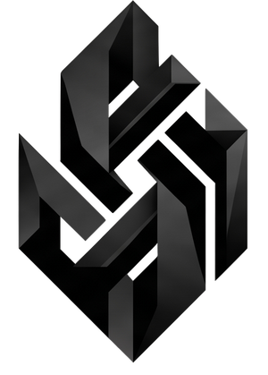

<p align="center">
  
</p>

<h1 align="center">NeoSyntropy Framework</h1>

<p align="center">
  <strong>Your code should control AI — not an agent controlling your code.</strong>
</p>
Agent frameworks leave two problems unsolved:

1. **High unit cost and uncontrolled token spend** — you pay for tokens, retries, and unnecessary reasoning instead of paying for a successful business outcome; every step can re-read context, trigger self-correction loops, and consume more tokens, while finance only sees the cost after the fact.

2. **Hallucinations** — models can invent steps, facts, and transitions that were never approved.


| | Process Unit Cost | Full Workflow Accuracy |
|---|---|---|
| **Before** — [BMad Agent](https://github.com/bmadcode/BMAD-METHOD) | High — pays per token, retry, and reasoning step regardless of outcome | Unpredictable — hallucinated steps and uncontrolled loops degrade end-to-end reliability |
| **After** — NeoSyntropy (`neo-code`) | Low — model is called only for narrow structured extraction; execution stays in your code | Deterministic — every transition is validated by a schema your application owns |


## The problem is not always the model. It is the execution loop.

In production, many AI workflows do not need an autonomous agent that reasons about what to do next and owns the entire execution loop.

**They need a model to understand unstructured input and turn it into structured parameters for a function your application already controls.**

If the next step is already known — call a refund function, look up an order, update a customer record, classify a request — there is little value in asking a powerful Foundation Model to repeatedly reason about the execution itself.

The model only needs to answer a narrow question:

**“Given this input, which parameters should I pass to this function?”**

That means the expensive, general-purpose reasoning capability of a Foundation Model can often be replaced by a small, task-specific model, while the application retains ownership of the actual decision and execution.

```python
from pydantic import BaseModel, ConfigDict
from neosyntropy import Client, function_calling

client = Client(api_key="your-api-key")

class CustomerRequest(BaseModel):
    model_config = ConfigDict(extra="forbid")
    text: str

class RefundParams(BaseModel):
    model_config = ConfigDict(extra="forbid")
    order_id: str
    amount: float

@function_calling(
    prompt="Extract the order id and requested refund amount.",
    input_schema=CustomerRequest,
    client=client,
)
def quote_refund(params: RefundParams) -> dict:
    # The model proposes parameters; trusted application code makes the decision.
    return {
        "order_id": params.order_id,
        "approved": params.amount <= 100
    }

result = quote_refund(text="Refund $40 for order ord_123")
```

**Unstructured input → model proposal → schema validation → trusted code execution**

This is the fundamental shift: **the model does not own the workflow.**

NeoSyntropy provides a deterministic control layer for AI workflows. Models can propose what should happen next, but a finite-state graph defines what is actually allowed to happen.

Every action follows a path defined by the developer — with **0% deviation from the business logic**, enforced at the engine level rather than requested through a prompt.

### From Foundation Models to task-specific models

This architecture also creates a path away from permanent dependence on Foundation Models.

You can start with a general model for Schema Nodes, Reasoning Nodes, validation, and other parts of the graph. Each execution is evaluated by a critic for logical validity.

As the workflow accumulates enough successful runs, NeoSyntropy automatically turns those executions into a training dataset and fine-tunes a small model specifically for that workflow, schema, and logic.

The loop stays inside the developer experience:

**Collect → Fine-tune → Evaluate → Deploy**

Because the resulting model is trained for one narrowly defined task rather than general reasoning, it can achieve the required performance with a fraction of the cost and latency of a general-purpose Foundation Model.

The result is an AI workflow where **models provide intelligence where it is needed, while the application remains deterministic, controllable, and economically predictable.**


## Core concepts

Start with decorators when adding AI to an ordinary function. Use a `Node`, a
router, and a `Group` when the operation needs multiple controlled steps.
`ControlManager` keeps every model proposal inside a fail-closed graph.

| Concept | Role |
|---|---|
| [`@function_calling` / `@workflow`](cookbook/decorators) | Turn a typed Python function into a controlled model call: predict validated parameters directly, or gather evidence in explicit reasoning steps first |
| [`Node`](docs/concepts-explained.md#2-node--node--executable-capability) | Executable capability (Python handler or provider-backed). [`reasoning`](cookbook/fsm/reasoning_node_prompt_tools_example.py) · [`schema extraction`](cookbook/fsm/schema_node_example.py) · [`validation`](neosyntropy/core/node/validation.py) |
| Router | [`semantic`](cookbook/fsm/semantic_router_sequential_example.py) — model picks among labeled targets, still validated against the graph. [`deterministic`](docs/concepts-explained.md#7-deterministicrouter--hard-rules) — first matching `(predicate, target)` rule wins |
| [`Group`](docs/concepts-explained.md#9-group--named-subgraph-optional) | Named node collection; optional `entry`, internal routers, and `add_edge` that compile into the FSM |
| [`Validation`](cookbook/validation) | Gate any FSM level: validate a single node output, a path through a `Group`, or the entire FSM run. [`node`](cookbook/validation/node_validation_example.py) · [`group`](cookbook/validation/group_path_validation_example.py) · [`fsm`](cookbook/validation/fsm_path_validation_example.py) |

Each concept explained (what / when / example):
[`docs/concepts-explained.md`](docs/concepts-explained.md) ·
[`cookbook/knowledge`](cookbook/knowledge) ·
[`cookbook/decorators`](cookbook/decorators)

Site docs:
[Nodes](https://docs.neosyntropy.com/concepts/nodes) ·
[Model-backed nodes](https://docs.neosyntropy.com/concepts/model-nodes) ·
[Routers](https://docs.neosyntropy.com/concepts/routers) ·
[Edges](https://docs.neosyntropy.com/concepts/edges) ·
[Groups](https://docs.neosyntropy.com/concepts/groups) ·
[Control manager](https://docs.neosyntropy.com/concepts/control-manager)

## Sign up

Create an account at [neosyntropy.com](https://neosyntropy.com) to use the
control plane. New accounts include **100 free node passes** so you can run
workflows before buying credits. Paid usage starts at **$0.005 per node**
(minimum); the starter package is **$10 for 1,000 state transitions**. After
sign-in, create a project and copy your API key + project id for the client
below (or use the **neo-code** CLI: `neo-code login`).

## Install

```bash
pip install neosyntropy
```

From a local checkout:

```bash
pip install -e .          # editable install
pip install -e ".[dev]"   # with pytest + ruff + build tools
```

## Create a project

Sign up at [neosyntropy.com](https://neosyntropy.com) to get an API key, then
create a project directly from Python:

```python
from neosyntropy import Client

client = Client(api_key="your-api-key")

# Create a new project and get back its id
project = client.create_project(
    name="Support automation",
    slug="support-automation",          # unique, URL-safe identifier
    description="Customer support FSM", # optional
)
print(project["id"])   # pass this as project_id= in subsequent Client(...) calls
```

Pass `base_url=` to target a self-hosted or local backend:

```python
client = Client(
    api_key="your-api-key",
    base_url="api.neosyntropy.com",   # or localhost in case your orgnization deploy neosyntropy in vpc. 
)
```

## Quickstart

```python
from pydantic import BaseModel, ConfigDict

from neosyntropy import (
    Client,
    EmptyOutput,
    OpenInput,
    SchemaNode,
    TextOutput,
    Workflow,
    node,
)

# Connect with a workspace API key from Settings. Pass project_id=... if you
# already have a project, or create/reuse one by slug:
client = Client(api_key="your-api-key")
client.create_project(name="Support Bot", slug="support-bot")


class RefundTicket(BaseModel):
    model_config = ConfigDict(extra="forbid")

    order_id: str
    amount: float
    reason: str


@node(id="VerifyIdentity", input_schema=OpenInput, output_schema=EmptyOutput)
def verify_identity(ctx):
    """Verify the requester owns the order."""
    return ctx.result(output={}, state_updates={"verified": True})

# Provider-backed: model must return JSON matching RefundTicket.
extract_ticket = SchemaNode(
    id="ExtractTicket",
    input_schema=OpenInput,
    output_schema=RefundTicket,
    prompt="Extract a refund ticket as JSON from the customer request.",
)

@node(id="IssueRefund", prerequisites=("ExtractTicket",), input_schema=OpenInput, output_schema=EmptyOutput)
def issue_refund(ctx):
    return ctx.result(output={}, state_updates={"refund_issued": True}, next_state="End")

@node(id="OutOfScope", is_fallback=True, input_schema=OpenInput, output_schema=TextOutput)
def out_of_scope(ctx):
    return ctx.result(output={"message": "Out of scope for this workflow."})

fsm = Workflow(
    [verify_identity, extract_ticket, issue_refund],
    fallback=out_of_scope,
)

result = fsm.run(
    {"text": "refund order ord_123 for 40 dollars — item arrived damaged"},
    client=client,
)

print(result.final_state)
print(result.audit.committed_transitions)
```

Every cycle returns a `RunResult` with a full `AuditRecord`. A rejection is a
normal outcome — `result.rejected` is set and the audit explains why.

More detail: [`docs/concepts-explained.md`](docs/concepts-explained.md) ·
[`examples/refund_workflow.py`](examples/refund_workflow.py) ·
[`cookbook/decorators`](cookbook/decorators)

## License

NeoSyntropy Framework is source-available under the
**NeoSyntropy Source Available License 1.0** (NSALv1), adapted from the
[Redis Source Available License 2.0 (RSALv2)](https://redis.io/legal/rsalv2-agreement/).

### Summary

You are free to use, copy, modify, and distribute NeoSyntropy Framework for your
own internal applications and non-competing products, subject to the terms below.

**Commercial use that exposes the framework's functionality to third parties
— including SaaS products, managed services, or embedded offerings — requires a
separate commercial agreement with NeoSyntropy.**

Contact **licensing@neosyntropy.com** to obtain a commercial license.

### Full License Terms

**Acceptance**

By using the software, you agree to all of the terms and conditions below.

**Copyright License**

The licensor grants you a non-exclusive, royalty-free, worldwide,
non-sublicensable, non-transferable license to use, copy, distribute, make
available, and prepare derivative works of the software, in each case subject to
the limitations and conditions below.

**Limitations**

You may not make the functionality of the software or a modified version available
to third parties as a service, or distribute the software or a modified version in
a manner that makes the functionality of the software available to third parties.

Making the functionality of the software or modified version available to third
parties includes, without limitation, enabling third parties to interact with the
functionality of the software or modified version in distributed form or remotely
through a computer network, offering a product or service the value of which
entirely or primarily derives from the value of the software or modified version,
or offering a product or service that accomplishes for users the primary purpose of
the software or modified version.

You may not alter, remove, or obscure any licensing, copyright, or other notices
of the licensor in the software. Any use of the licensor's trademarks is subject
to applicable law.

**Commercial License**

Any use that falls outside the permissions above — including building products or
services that make the framework's functionality available to third parties —
requires a commercial license from NeoSyntropy. Contact
**licensing@neosyntropy.com** to discuss commercial licensing terms.

**Patents**

The licensor grants you a license, under any patent claims the licensor can
license, or becomes able to license, to make, have made, use, sell, offer for
sale, import and have imported the software, in each case subject to the
limitations and conditions in this license. This license does not cover any patent
claims that you cause to be infringed by modifications or additions to the
software. If you or your company make any written claim that the software
infringes or contributes to infringement of any patent, your patent license for
the software granted under these terms ends immediately. If your company makes
such a claim, your patent license ends immediately for work on behalf of your
company.

**Notices**

You must ensure that anyone who gets a copy of any part of the software from you
also gets a copy of these terms. If you modify the software, you must include in
any modified copies prominent notices stating that you have modified the software.

**No Other Rights**

These terms do not imply any licenses other than those expressly granted in these
terms.

**Termination**

If you use the software in violation of these terms, such use is not licensed, and
your licenses will automatically terminate. If the licensor provides you with a
notice of your violation, and you cease all violations of this license no later
than 30 days after you receive that notice, your licenses will be reinstated
retroactively. However, if you violate these terms after such reinstatement, any
additional violation of these terms will cause your licenses to terminate
automatically and permanently.

**No Liability**

As far as the law allows, the software comes as is, without any warranty or
condition, and the licensor will not be liable to you for any damages arising out
of these terms or the use or nature of the software, under any kind of legal
claim.
