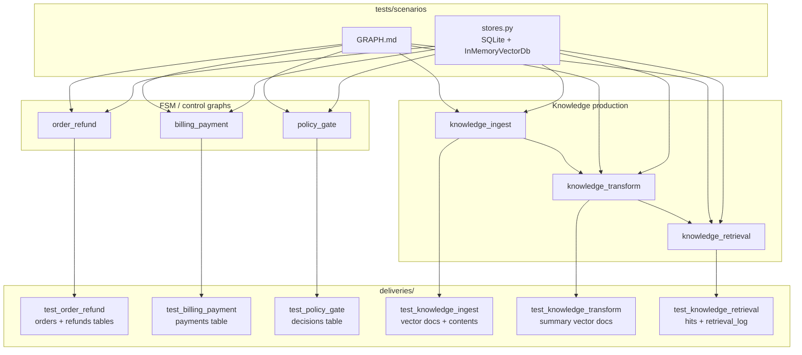
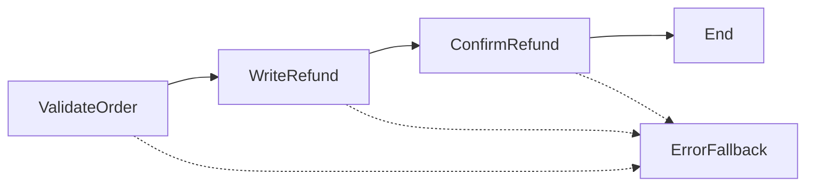
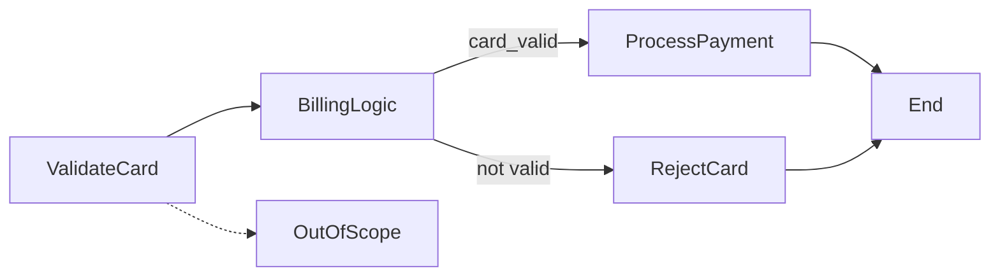
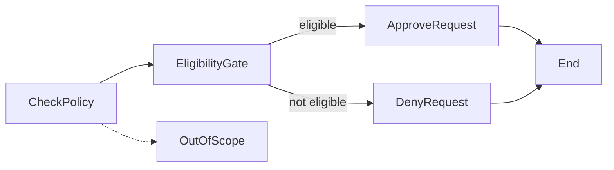
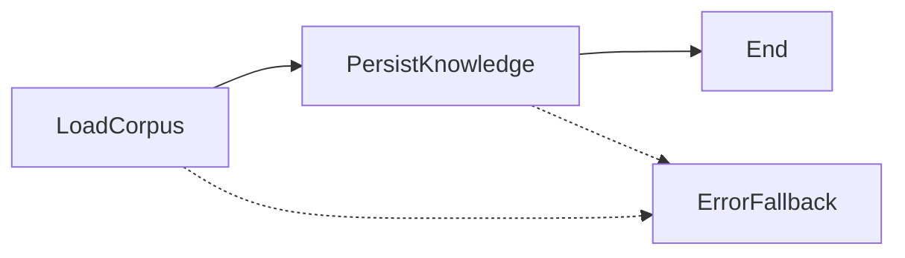
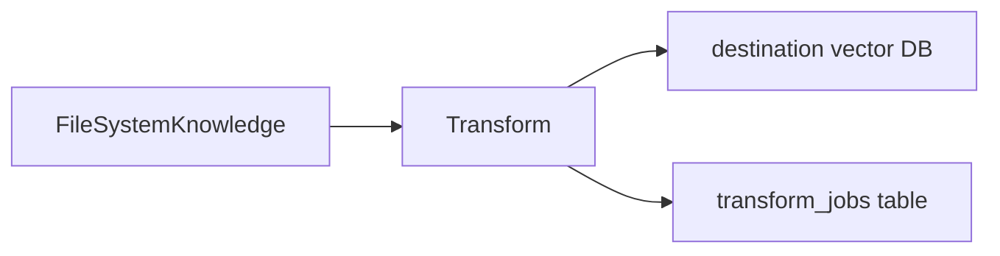
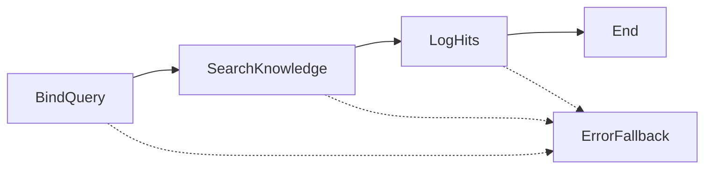

# Scenario map

This directory is the **scenario map**: production-style graphs that leave
unit tests and run against related stores (relational tables, vector indexes,
filesystem corpora).

| Path | Role |
|---|---|
| [`GRAPH.md`](GRAPH.md) (this file) | Map of every scenario and its graph |
| `<scenario>/scenario.py` | Story **and** executable code in one file |
| [`deliveries/`](deliveries/) | Per-scenario tests that the run really landed (DB, vector, files) |

```text
tests/scenarios/
├── GRAPH.md
├── stores.py                  shared in-memory SQLite + vector adapters
├── order_refund/scenario.py
├── billing_payment/scenario.py
├── policy_gate/scenario.py
├── knowledge_ingest/scenario.py
├── knowledge_transform/scenario.py
├── knowledge_retrieval/scenario.py
└── deliveries/
    ├── test_order_refund.py
    ├── test_billing_payment.py
    ├── test_policy_gate.py
    ├── test_knowledge_ingest.py
    ├── test_knowledge_transform.py
    ├── test_knowledge_retrieval.py
    └── test_scenario_map.py
```

## How the map is wired



## Scenario graphs

### order_refund

Validate an existing order, persist a refund row, then mark the order refunded.



### billing_payment

Group-scoped card check, then a deterministic router to capture or reject.



### policy_gate

Hard eligibility rule (account age) written to a decisions table.



### knowledge_ingest

Python workflow loads documents into `Knowledge` (vector DB) and a contents table.



### knowledge_transform

Filesystem corpus → transform summaries → destination `Knowledge` vector store.



### knowledge_retrieval

Search ingested Knowledge, then log hits so deliveries can query `retrieval_log`.


