# Scenario map

This directory is the **scenario map**: production-style graphs that leave
unit tests and run against related stores (relational tables, vector indexes,
filesystem corpora), plus **copies of every cookbook example**.

| Path | Role |
|---|---|
| [`GRAPH.md`](GRAPH.md) (this file) | Map of every scenario and its graph |
| [`BACKEND.md`](BACKEND.md) | Which backend APIs each cookbook should validate live |
| `<scenario>/scenario.py` | Story **and** executable code in one file |
| [`cookbook_support.py`](cookbook_support.py) | Loader, offline provider, and API catalog for cookbook copies |
| [`deliveries/`](deliveries/) | Per-scenario tests that the run really landed (DB, vector, files) |

```text
tests/scenarios/
├── GRAPH.md
├── BACKEND.md
├── stores.py
├── cookbook_support.py
├── order_refund/scenario.py
├── billing_payment/scenario.py
├── policy_gate/scenario.py
├── knowledge_ingest/scenario.py
├── knowledge_transform/scenario.py
├── knowledge_retrieval/scenario.py
├── cookbook_python_node/scenario.py
├── cookbook_schema_node/scenario.py
├── cookbook_reasoning_prompt_tools/scenario.py
├── cookbook_reasoning_steps/scenario.py
├── cookbook_semantic_router_parallel/scenario.py
├── cookbook_semantic_router_sequential/scenario.py
├── cookbook_node_kpi/scenario.py
├── cookbook_group_kpi/scenario.py
├── cookbook_fsm_path_kpi/scenario.py
├── cookbook_node_validation/scenario.py
├── cookbook_group_path_validation/scenario.py
├── cookbook_fsm_path_validation/scenario.py
├── cookbook_function_calling/scenario.py
├── cookbook_workflow_reasoning/scenario.py
├── cookbook_filesystem/scenario.py
├── cookbook_web_search/scenario.py
├── cookbook_email/scenario.py
├── cookbook_knowledge_retrieval/scenario.py
├── cookbook_knowledge_transform/scenario.py
└── deliveries/
```

## How the map is wired

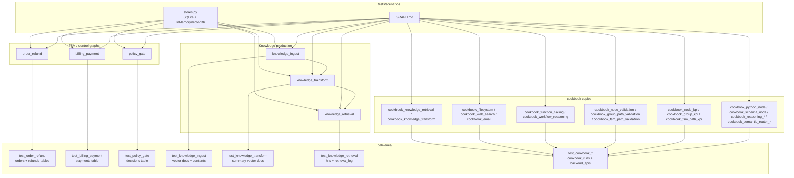

## Scenario graphs

### order_refund

Validate an existing order, persist a refund row, then mark the order refunded.

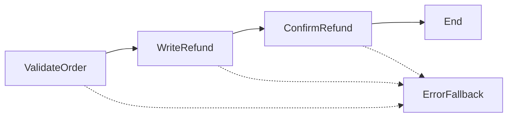

### billing_payment

Group-scoped card check, then a deterministic router to capture or reject.

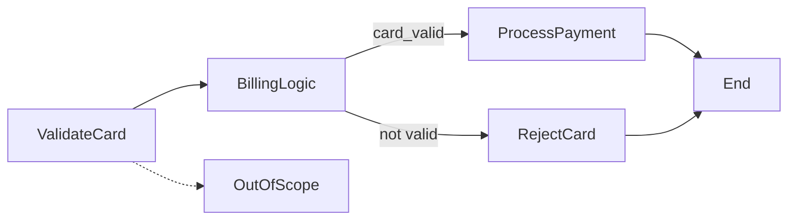

### policy_gate

Hard eligibility rule (account age) written to a decisions table.

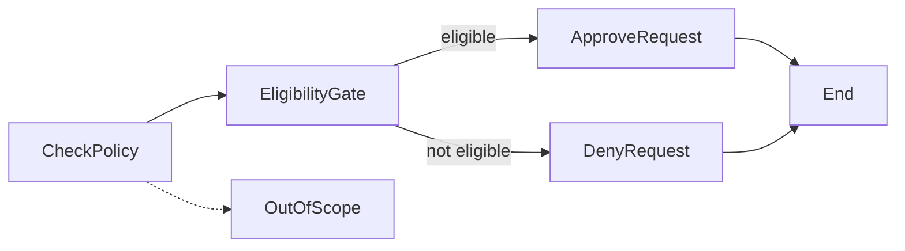

### knowledge_ingest

Python workflow loads documents into `Knowledge` (vector DB) and a contents table.

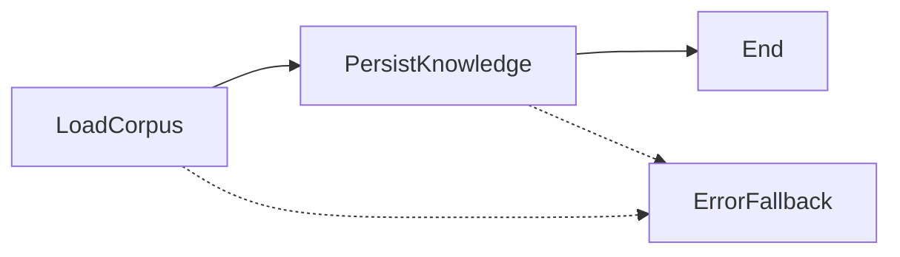

### knowledge_transform

Filesystem corpus → transform summaries → destination `Knowledge` vector store.

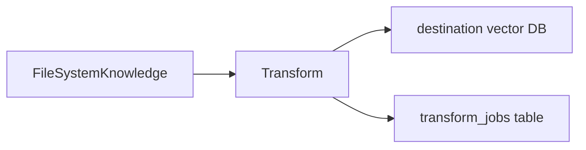

### knowledge_retrieval

Search ingested Knowledge, then log hits so deliveries can query `retrieval_log`.

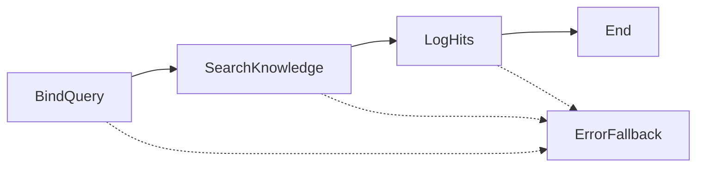

## Cookbook copies

Each `cookbook_*` scenario loads the matching file under `cookbook/` and
runs it offline. Live backend endpoints for the same graphs are listed in
[`BACKEND.md`](BACKEND.md).

### cookbook_python_node

Copy of `cookbook/fsm/python_node_example.py`.

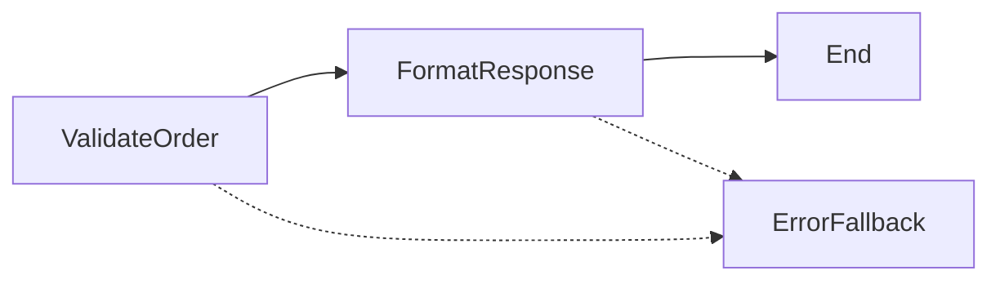

### cookbook_schema_node

Copy of `cookbook/fsm/schema_node_example.py`.

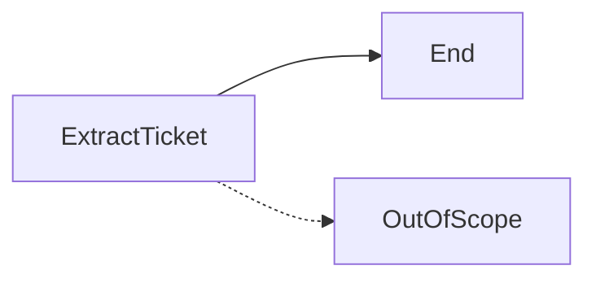

### cookbook_reasoning_prompt_tools

Copy of `cookbook/fsm/reasoning_node_prompt_tools_example.py`.

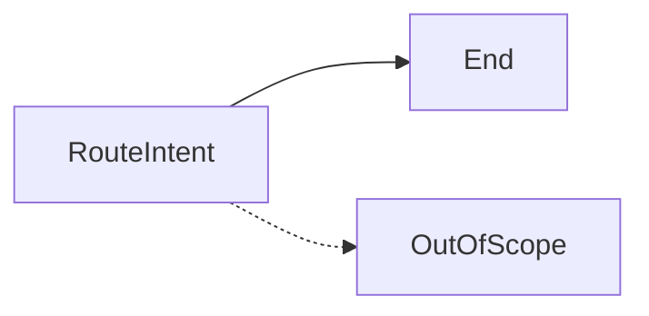

### cookbook_reasoning_steps

Copy of `cookbook/fsm/reasoning_node_steps_example.py`.

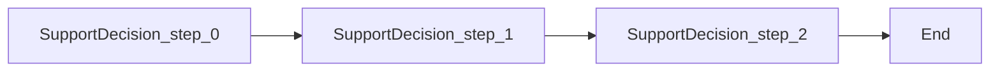

### cookbook_semantic_router_parallel

Copy of `cookbook/fsm/semantic_router_parallel_example.py`.

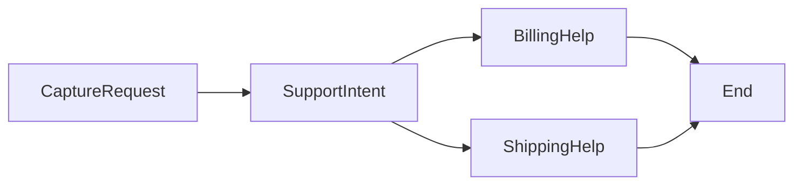

### cookbook_semantic_router_sequential

Copy of `cookbook/fsm/semantic_router_sequential_example.py`.

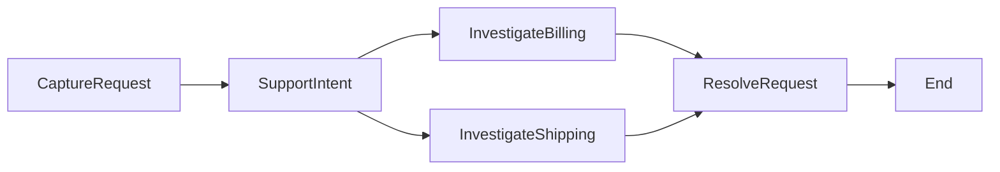

### cookbook_node_kpi

Copy of `cookbook/kpi/node_kpi_example.py`.

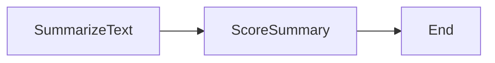

### cookbook_group_kpi

Copy of `cookbook/kpi/group_kpi_example.py`.

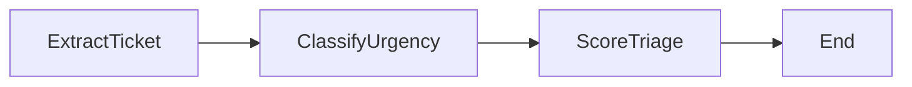

### cookbook_fsm_path_kpi

Copy of `cookbook/kpi/fsm_path_kpi_example.py`.

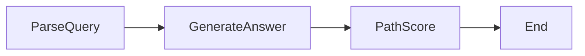

### cookbook_node_validation

Copy of `cookbook/validation/node_validation_example.py`.

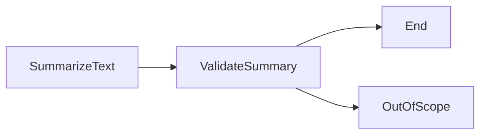

### cookbook_group_path_validation

Copy of `cookbook/validation/group_path_validation_example.py`.

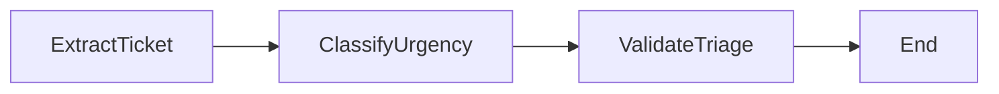

### cookbook_fsm_path_validation

Copy of `cookbook/validation/fsm_path_validation_example.py`.

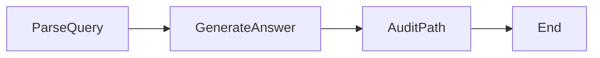

### cookbook_function_calling

Copy of `cookbook/decorators/function_calling_example.py`.

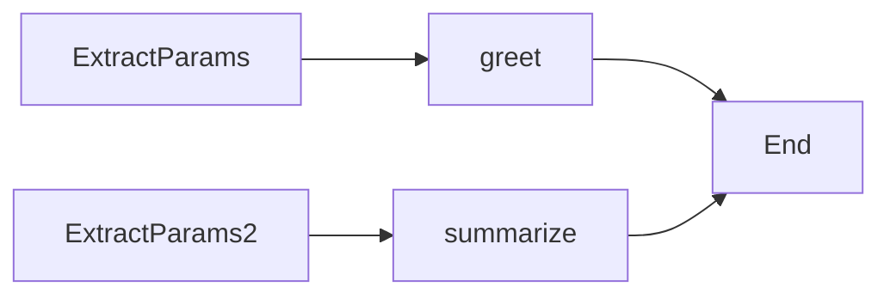

### cookbook_workflow_reasoning

Copy of `cookbook/decorators/workflow_reasoning_example.py`.

```mermaid
flowchart LR
    lookup_sku --> check_stock --> ExtractParams --> place_order
```

### cookbook_filesystem

Copy of `cookbook/tools/filesystem_example.py`. Local toolkit only.

### cookbook_web_search

Copy of `cookbook/tools/web_search_example.py`. Local toolkit only.

### cookbook_email

Copy of `cookbook/tools/email_example.py`. Local toolkit only (intended message recorded; SMTP not sent).

### cookbook_knowledge_retrieval

Copy of `cookbook/knowledge/retrieval_example.py` (`FileSystemKnowledge.search`).

### cookbook_knowledge_transform

Copy of `cookbook/knowledge/transform_example.py` (`Knowledge.transform`).
